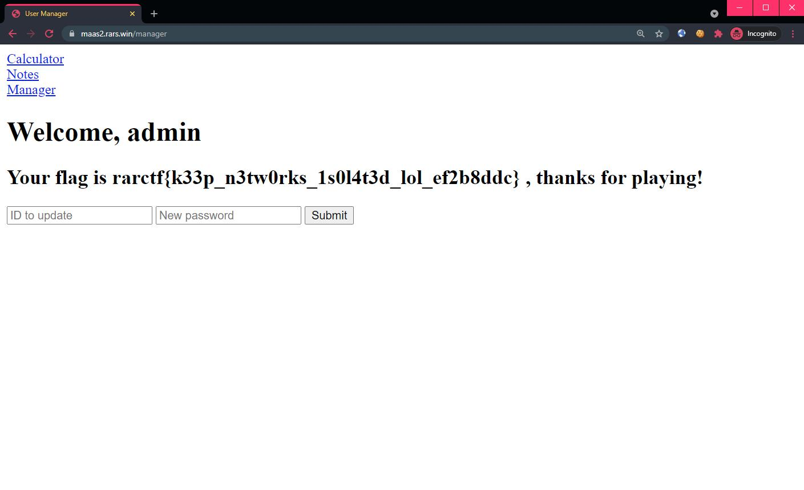

# Microservice as a Service 3.5

```
A fix for MAAS3

https://maas2.rars.win/
```

## Challenge

> TL;DR: Does not appear to be patched and the same exploit for MaaS 3 works again. 😄

Take a look at the write-up [here](maas3.md).

<br>

Flag: `rarctf{k33p_n3tw0rks_1s0l4t3d_lol_ef2b8ddc}`
