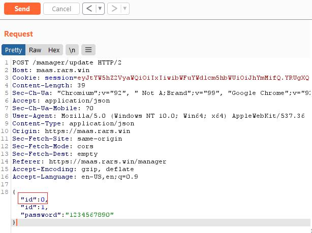
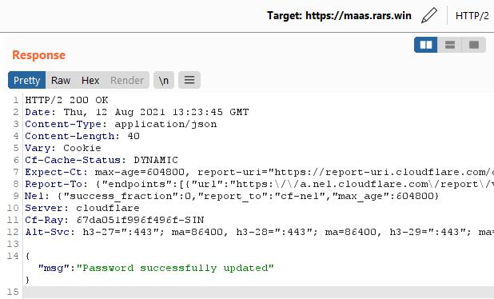
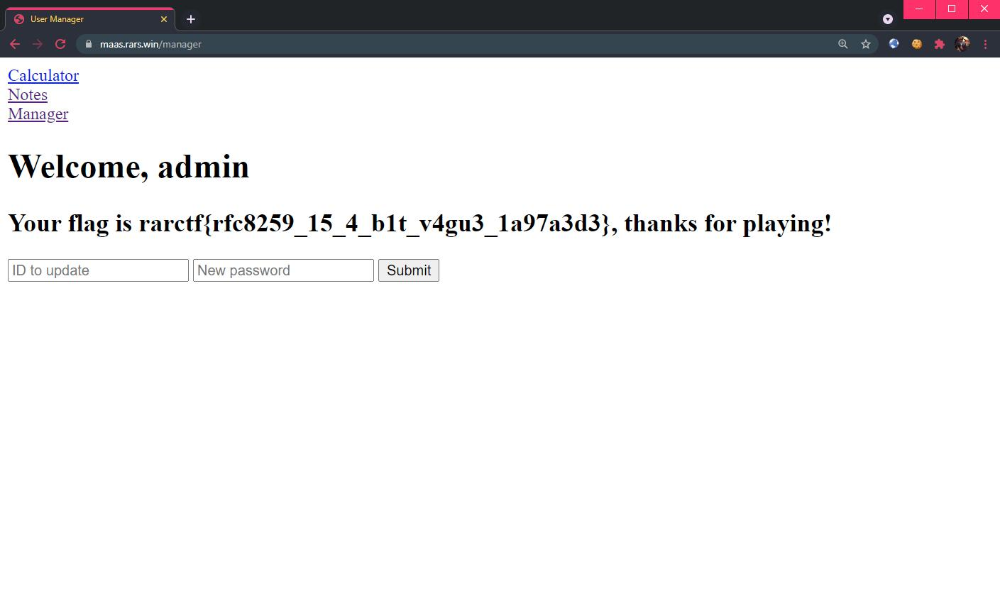

# Microservice as a Service 3

```
Part 3: User manager

https://maas.rars.win/
```

## Challenge 

> TL;DR: Different programming languages processes HTTP `request.body` data differently. When the same request is parsed by different languages, assumptions may break.

Once again, we begin by analyzing the docker network layout. We will be able to access `manager` from the main application. We also see that there are 2 additional hosts, `manager_users` and `manager_updater`, which we cannot reach from the main application directly as they reside in `manager-net`\*:

```yml
  manager:
    build: manager
    depends_on: ["manager_users", "manager_updater"]
    networks:
      - level-1
      - manager-net
  manager_users:
    image: library/redis:latest
    networks:
      - manager-net
  manager_updater:
    build: manager/updater
    networks:
      - level-1
      - manager-net
```

> \* Looks like there is a configuration mistake as `manager_updater` is accessible via `level-1` network (which can be pivoted from previous MaaS challenges `calculator` and `notes`)

Analysing the main application routing for `manager`, we see that we are able to register and afterwards we are able to request a password update.

**Source**: `app/app.py`
```py
@app.route("/manager/login", methods=["POST"])
def manager_login():
    username = request.form.get("username")
    password = request.form.get("password")
    r = requests.post("http://manager:5000/login", json={
        "username": username,
        "password": password
    })
    response = r.json()
    if response.get('error'):
        return response['error'], 403
    session['managerid'] = response['uid']
    session['managername'] = response['name']
    if response.get('flag'):
        session['flag'] = response['flag']
    return redirect("/manager")

@app.route("/manager/update", methods=["POST"])
def manager_update():
    uid = int(request.args['id'])
    schema = {"type": "object",
              "properties": {
                  "id": {
                      "type": "number",
                      "minimum": int(session['managerid'])
                  },
                  "password": {
                      "type": "string",
                      "minLength": 10
                  }
              }}
    payload = json.loads(request.get_data())
    try:
        jsonschema.validate(payload, schema)
    except jsonschema.exceptions.ValidationError:
        return jsonify({"error": f"Invalid data provided"})
    return jsonify(requests.post("http://manager:5000/update",
                                 data=request.get_data()).json())
```

Post authentication, we can request a password update for a specified user `id`. However, we see that the input values are passed through a `jsonschema.validate()` check. According to the schema, the specified `uid` can only be greater or equal than the current session user's `uid`. Also, the new password must be 10 characters long.

If we pass the validation, a request is made to `manager` to update the password for the specified `id`.

**Source**: `app/manager/app.py`
```py
@app.route("/update", methods=["POST"])
def update():
    return jsonify(requests.post("http://manager_updater:8080/",
                                 data=request.get_data()).json())
```

A request is made to the `manager_updater` host where a Redis database is used to store the user credentials.

**Source**: `app/manager/updater/main.go`
```go
func update(w http.ResponseWriter, req *http.Request) {
	body, err := io.ReadAll(req.Body)
	if err != nil {
		w.WriteHeader(http.StatusInternalServerError)
		return
	}
	uid, err := jsonparser.GetInt(body, "id")
```

Well, since the `id` parameter can only be equal or greater than our current session, and the admin `id` is 0, what if we specified 2 `id` in our request? We will set the first `id` to 0 and the second `id` to 1 (our current id).



Which works, giving us the message that the password has been changed.



Logging in as `admin` gives us the flag:

<br>

Flag: `rarctf{rfc8259_15_4_b1t_v4gu3_1a97a3d3}`

## Reference
* https://labs.bishopfox.com/tech-blog/an-exploration-of-json-interoperability-vulnerabilities
